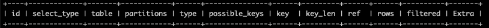

### 查看索引

    ```bash
    # 列出表中所有的索引项 
    SHOW index FROM table_name;
    ```

### 执行计划

- 执行计划会描述Mysql对语句的执行情况，包含索引使用，扫描类型等信息。
  
    ```bash
     EXPLAIN any_sql_sentence;
    ```

- 执行计划结果字段：
  
    
  
#### 关键分析字段

 - id: 执行顺序，相同时由上至下，不同时从大到小（子查询）。

 - type: 扫描方式，性能由好到差:
   
    1. system：系统表，少量数据，往往不需要进行磁盘IO 
    2. const：常量连接
    3. eq_ref：主键索引(primary key)或者非空唯一索引(unique not null)等值扫描
    4. ref：非主键非唯一索引等值扫描
    5. range：范围扫描
    6. index：索引树扫描(full index scan)
    7. ALL：全表扫描(full table scan)
 
 - possible_keys： 可能利用的索引。

 - key：实际使用的索引，如果是NULL，则没命中索引，需要优化。

 - extra: 查询执行的额外信息。

    - `Using where` 应该出现，否则应该检查type是否出现ALL或者index。
    - `Using temporary` 使用了临时表，一般查询语句包含了GROUP BY或者ORDER BY。
    - `Using filesort` ORDER BY无法利用索引，需要额外内存，甚至临时磁盘空间，需要优化。
  
 - filtered: 预估满足查询条件的行数比例，最大100表示全表。


### 参考资料
官方文档: https://dev.mysql.com/doc/refman/8.0/en/using-explain.html